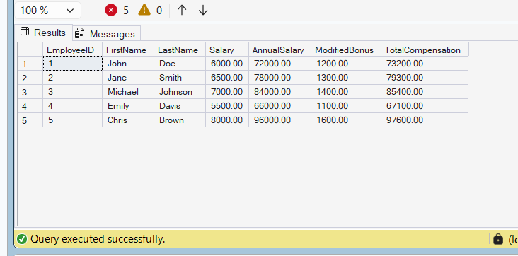

# Exercise 10: Modify a Nested User-Defined Function

## Goal

Modify the `fn_CalculateTotalCompensation` function to use the updated `fn_CalculateBonus` function.

## Modified Bonus Function

```sql
ALTER FUNCTION fn_CalculateBonus
(
    @Salary DECIMAL(10,2)
)
RETURNS DECIMAL(10,2)
AS
BEGIN
    RETURN @Salary * 0.20;
END;
```

## Modified Nested Function

```sql
ALTER FUNCTION fn_CalculateTotalCompensation
(
    @Salary DECIMAL(10,2)
)
RETURNS DECIMAL(10,2)
AS
BEGIN
    DECLARE @AnnualSalary DECIMAL(10,2);
    DECLARE @Bonus DECIMAL(10,2);

    SET @AnnualSalary = dbo.fn_CalculateAnnualSalary(@Salary);
    SET @Bonus = dbo.fn_CalculateBonus(@Salary);

    RETURN @AnnualSalary + @Bonus;
END;
```

## Test Query

```sql
SELECT
    EmployeeID,
    FirstName,
    LastName,
    Salary,
    dbo.fn_CalculateAnnualSalary(Salary) AS AnnualSalary,
    dbo.fn_CalculateBonus(Salary) AS ModifiedBonus,
    dbo.fn_CalculateTotalCompensation(Salary) AS TotalCompensation
FROM Employees;
```

## Explanation

- Modified the bonus calculation from 10% to 20%.
- Updated the nested function to use the modified bonus function.
- Verified the new total compensation values for all employees.

## Output Screenshot



## Result

Successfully modified the nested user-defined function and verified the updated compensation calculation.