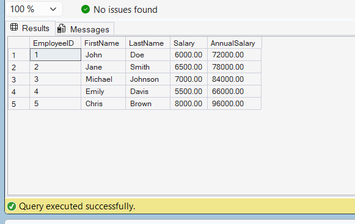

# Exercise 1 - Create a Scalar Function

## Objective

Create a scalar function that calculates the annual salary of an employee.

## Database

CognizantAdvancedSQL

## Function Created

fn_CalculateAnnualSalary

## SQL Used

```sql
CREATE FUNCTION fn_CalculateAnnualSalary
(
    @Salary DECIMAL(10,2)
)
RETURNS DECIMAL(12,2)
AS
BEGIN
    RETURN @Salary * 12;
END;
```

## Test Query

```sql
SELECT
    EmployeeID,
    FirstName,
    LastName,
    Salary,
    dbo.fn_CalculateAnnualSalary(Salary) AS AnnualSalary
FROM Employees;
```

## Output Screenshot



## Concepts Used

* User Defined Functions (UDF)
* Scalar Functions
* Parameters
* Return Values

## Result

Successfully created a scalar function to calculate annual salary using monthly salary.
