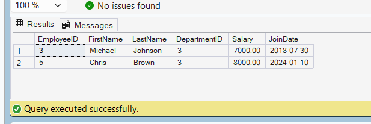

# Exercise 2 - Table-Valued Function

## Objective

Create a table-valued function to return employees belonging to a specific department.

## Database

CognizantAdvancedSQL

## Function Created

fn_GetEmployeesByDepartment

## SQL Used

```sql
CREATE FUNCTION fn_GetEmployeesByDepartment
(
    @DepartmentID INT
)
RETURNS TABLE
AS
RETURN
(
    SELECT
        EmployeeID,
        FirstName,
        LastName,
        DepartmentID,
        Salary,
        JoinDate
    FROM Employees
    WHERE DepartmentID = @DepartmentID
);
```

## Test Query

```sql
SELECT *
FROM dbo.fn_GetEmployeesByDepartment(3);
```

## Output Screenshot



## Concepts Used

* User Defined Functions (UDF)
* Table-Valued Functions
* Parameters
* Filtering Data

## Result

Successfully created a table-valued function that returns employee details for a specified department.
