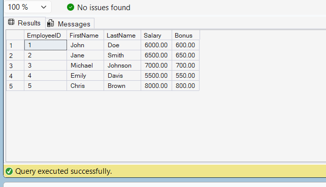

# Exercise 3 - User Defined Function

## Objective

Create a user-defined function to calculate employee bonus.

## Database

CognizantAdvancedSQL

## Function Created

fn_CalculateBonus

## SQL Used

```sql
CREATE FUNCTION fn_CalculateBonus
(
    @Salary DECIMAL(10,2)
)
RETURNS DECIMAL(12,2)
AS
BEGIN
    RETURN @Salary * 0.10;
END;
```

## Test Query

```sql
SELECT
    EmployeeID,
    FirstName,
    LastName,
    Salary,
    dbo.fn_CalculateBonus(Salary) AS Bonus
FROM Employees;
```

## Output Screenshot



## Concepts Used

* User Defined Functions (UDF)
* Scalar Functions
* Parameters
* Return Values
* Bonus Calculation

## Result

Successfully created a user-defined function to calculate 10% bonus based on employee salary.
