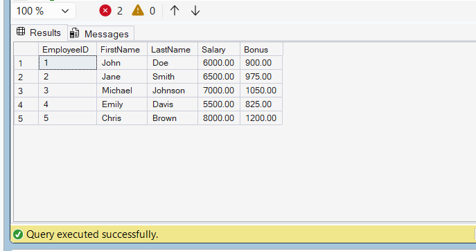

# Exercise 4 - Modify User Defined Function

## Objective

Modify the existing fn_CalculateBonus function to return 15% of employee salary instead of 10%.

## Database

CognizantAdvancedSQL

## Function Modified

fn_CalculateBonus

## SQL Used

```sql
ALTER FUNCTION fn_CalculateBonus
(
    @Salary DECIMAL(10,2)
)
RETURNS DECIMAL(12,2)
AS
BEGIN
    RETURN @Salary * 0.15;
END;
```

## Test Query

```sql
SELECT
    EmployeeID,
    FirstName,
    LastName,
    Salary,
    dbo.fn_CalculateBonus(Salary) AS Bonus
FROM Employees;
```

## Output Screenshot



## Concepts Used

* User Defined Functions (UDF)
* ALTER FUNCTION
* Scalar Functions
* Return Values

## Result

Successfully modified the fn_CalculateBonus function to calculate 15% bonus based on employee salary.
