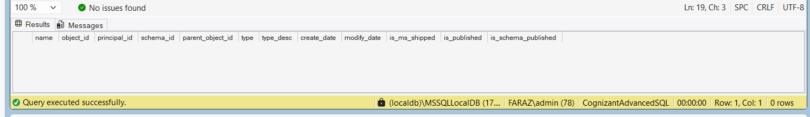

# Exercise 5 - Delete User Defined Function

## Objective

Delete the user-defined function `fn_CalculateBonus` and verify that it has been removed from the database.

## Database

CognizantAdvancedSQL

## Function Deleted

fn_CalculateBonus

## SQL Used

```sql
USE CognizantAdvancedSQL;
GO

DROP FUNCTION IF EXISTS fn_CalculateBonus;
GO
```

## Verification Query

```sql
SELECT *
FROM sys.objects
WHERE name = 'fn_CalculateBonus'
      AND type = 'FN';
GO
```

## Expected Result

The verification query should return **0 rows**, indicating that the function no longer exists in the database.

## Output Screenshot



## Concepts Used

- User Defined Functions (UDF)
- DROP FUNCTION
- Function Deletion
- System Catalog Views
- Verification Queries

## Result

Successfully deleted the user-defined function `fn_CalculateBonus` and verified its removal from the database using the system catalog view.