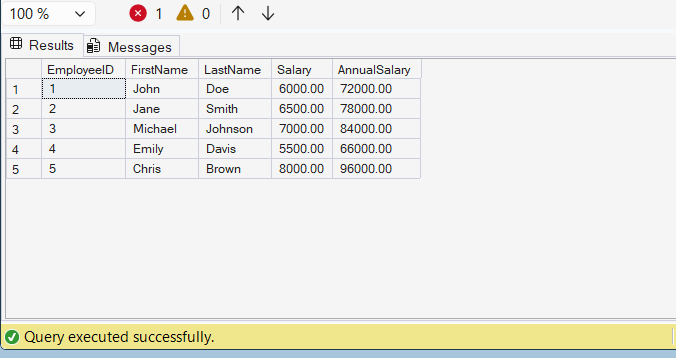

# Exercise 6 - Execute a User Defined Function

## Objective

Execute the user-defined function `fn_CalculateAnnualSalary` to calculate the annual salary of each employee.

## Database

CognizantAdvancedSQL

## Function Used

fn_CalculateAnnualSalary

## SQL Used

```sql
SELECT
    EmployeeID,
    FirstName,
    LastName,
    Salary,
    dbo.fn_CalculateAnnualSalary(Salary) AS AnnualSalary
FROM Employees;
```

## Output Screenshot



## Concepts Used

- User Defined Functions (UDF)
- Scalar Functions
- Function Execution
- Annual Salary Calculation

## Result

Successfully executed the `fn_CalculateAnnualSalary` function and calculated annual salaries for all employees.