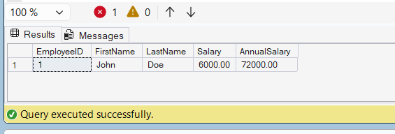

# Exercise 7 - Return Data from a Scalar Function

## Objective

Return the annual salary for a specific employee using the `fn_CalculateAnnualSalary` function.

## Database

CognizantAdvancedSQL

## Function Used

fn_CalculateAnnualSalary

## SQL Used

```sql
SELECT
    EmployeeID,
    FirstName,
    LastName,
    Salary,
    dbo.fn_CalculateAnnualSalary(Salary) AS AnnualSalary
FROM Employees
WHERE EmployeeID = 1;
```

## Output Screenshot



## Concepts Used

- User Defined Functions (UDF)
- Scalar Functions
- Function Execution
- Filtering Data using WHERE clause

## Result

Successfully executed the `fn_CalculateAnnualSalary` function for EmployeeID = 1 and returned the employee's annual salary.