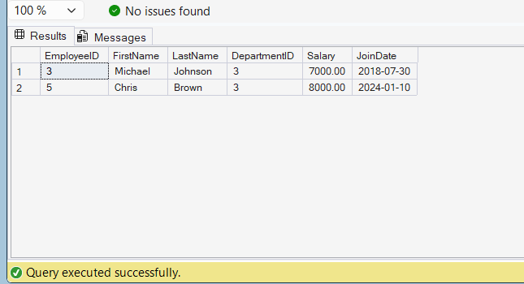

# Exercise 8: Return Data from a Table-Valued Function

## Goal
Return employees from the Finance department using the `fn_GetEmployeesByDepartment` table-valued function.

## SQL Query

```sql
USE CognizantAdvancedSQL;
GO

SELECT *
FROM dbo.fn_GetEmployeesByDepartment(3);
GO
```

## Explanation

- `fn_GetEmployeesByDepartment` is a table-valued function.
- DepartmentID `3` represents the Finance department.
- The function returns all employees belonging to the specified department.

## Output

The query successfully returned employees from the Finance department.

| EmployeeID | FirstName | LastName | DepartmentID | Salary | JoinDate |
|------------|------------|------------|------------|------------|------------|
| 3 | Michael | Johnson | 3 | 7000.00 | 2018-07-30 |
| 5 | Chris | Brown | 3 | 8000.00 | 2024-01-10 |

## Output Screenshot



## Result

Successfully retrieved employee details from the Finance department using the `fn_GetEmployeesByDepartment` table-valued function.