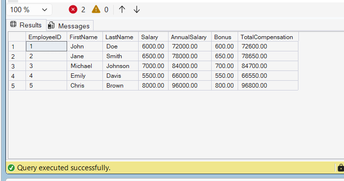

# Exercise 9: Create a Nested User-Defined Function

## Goal

Create a nested user-defined function named `fn_CalculateTotalCompensation` that uses `fn_CalculateAnnualSalary` and `fn_CalculateBonus` to calculate total compensation for each employee.

## Function Definition

```sql
CREATE FUNCTION fn_CalculateTotalCompensation
(
    @Salary DECIMAL(10,2)
)
RETURNS DECIMAL(10,2)
AS
BEGIN
    DECLARE @AnnualSalary DECIMAL(10,2);
    DECLARE @Bonus DECIMAL(10,2);

    SET @AnnualSalary = dbo.fn_CalculateAnnualSalary(@Salary);
    SET @Bonus = dbo.fn_CalculateBonus(@Salary);

    RETURN @AnnualSalary + @Bonus;
END;
```

## Test Query

```sql
SELECT
    EmployeeID,
    FirstName,
    LastName,
    Salary,
    dbo.fn_CalculateAnnualSalary(Salary) AS AnnualSalary,
    dbo.fn_CalculateBonus(Salary) AS Bonus,
    dbo.fn_CalculateTotalCompensation(Salary) AS TotalCompensation
FROM Employees;
```

## Explanation

- `fn_CalculateAnnualSalary` calculates annual salary.
- `fn_CalculateBonus` calculates employee bonus.
- `fn_CalculateTotalCompensation` is a nested function that combines annual salary and bonus.
- The function returns total employee compensation.

## Output

| EmployeeID | FirstName | LastName | Salary | AnnualSalary | Bonus | TotalCompensation |
|------------|-----------|----------|---------|--------------|-------|-------------------|
| 1 | John | Doe | 6000.00 | 72000.00 | 600.00 | 72600.00 |
| 2 | Jane | Smith | 6500.00 | 78000.00 | 650.00 | 78650.00 |
| 3 | Michael | Johnson | 7000.00 | 84000.00 | 700.00 | 84700.00 |
| 4 | Emily | Davis | 5500.00 | 66000.00 | 550.00 | 66550.00 |
| 5 | Chris | Brown | 8000.00 | 96000.00 | 800.00 | 96800.00 |

## Output Screenshot



## Result

Successfully created and tested a nested user-defined function to calculate total employee compensation using annual salary and bonus functions.