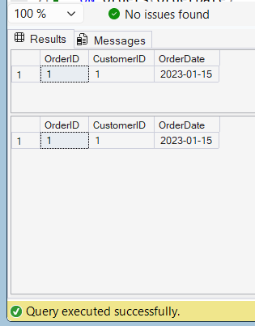

# Exercise 2: Clustered Index

## Objective
Create a Clustered Index on the `OrderDate` column of the `Orders` table and compare query execution before and after index creation.

## Database Used
CognizantAdvancedSQL

## SQL Concepts
- Clustered Index
- Query Optimization
- Indexing in SQL Server

## Query

```sql
SELECT *
FROM Orders
WHERE OrderDate = '2023-01-15';

CREATE CLUSTERED INDEX IX_Orders_OrderDate
ON Orders(OrderDate);

SELECT *
FROM Orders
WHERE OrderDate = '2023-01-15';
```

## Output

Before Index Creation:

| OrderID | CustomerID | OrderDate |
|----------|------------|------------|
| 1 | 1 | 2023-01-15 |

After Index Creation:

| OrderID | CustomerID | OrderDate |
|----------|------------|------------|
| 1 | 1 | 2023-01-15 |

## Screenshot



## Result

A Clustered Index was successfully created on the `OrderDate` column of the `Orders` table. The query returned the same data before and after index creation, while the index improves data retrieval performance.