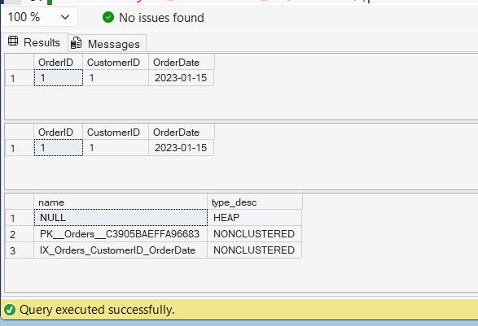

# Exercise 3: Composite Index

## Objective

Create a Composite Index on the `CustomerID` and `OrderDate` columns of the `Orders` table and compare query execution before and after index creation.

## Database Used

CognizantAdvancedSQL

## SQL Concepts

- Composite Index
- Non-Clustered Index
- Query Optimization

## Query

```sql
SELECT *
FROM Orders
WHERE CustomerID = 1
AND OrderDate = '2023-01-15';

CREATE NONCLUSTERED INDEX IX_Orders_CustomerID_OrderDate
ON Orders(CustomerID, OrderDate);

SELECT *
FROM Orders
WHERE CustomerID = 1
AND OrderDate = '2023-01-15';
```

## Output

Before Index Creation:

| OrderID | CustomerID | OrderDate |
|----------|------------|------------|
| 1 | 1 | 2023-01-15 |

After Index Creation:

| OrderID | CustomerID | OrderDate |
|----------|------------|------------|
| 1 | 1 | 2023-01-15 |

## Screenshot



## Result

A Composite Non-Clustered Index was successfully created on the `CustomerID` and `OrderDate` columns of the `Orders` table. This index improves query performance when filtering by both columns together.