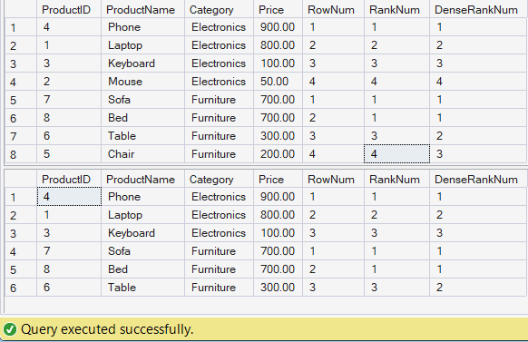

# Exercise 1: Ranking and Window Functions

## Objective

Use ROW_NUMBER(), RANK(), DENSE_RANK(), OVER(), and PARTITION BY to rank products within each category.

## Tables Used

* Products

## SQL Concepts Used

* ROW_NUMBER()
* RANK()
* DENSE_RANK()
* OVER()
* PARTITION BY

## Output

## Result

Successfully ranked products category-wise and retrieved the top 3 most expensive products from each category.
