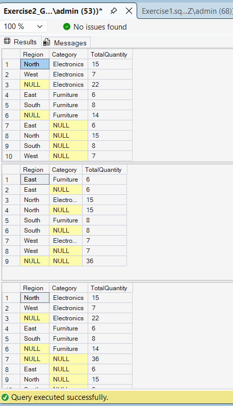

# Exercise 2: Aggregation with GROUPING SETS, CUBE and ROLLUP

## Objective

Analyze sales data across multiple dimensions using GROUPING SETS, ROLLUP, and CUBE.

## Tables Used

* Customers
* Orders
* OrderDetails
* Products_Sales

## SQL Concepts Used

* GROUPING SETS
* ROLLUP
* CUBE
* Aggregate Functions
* JOINs

## Output

## Result

Successfully generated aggregated sales reports by Region and Category using GROUPING SETS, ROLLUP, and CUBE.
