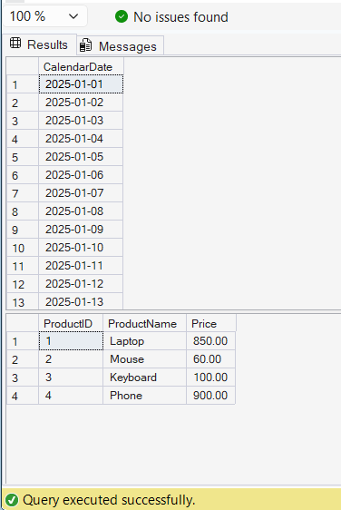

# Exercise 3: CTEs and MERGE

## Objective

Use Recursive CTE and MERGE statement.

## Concepts Used

* WITH
* Recursive CTE
* DATEADD()
* MERGE
* UPDATE
* INSERT

## Tables Used

* ProductPrices
* StagingProducts

## Output

## Result

Successfully generated a calendar table using Recursive CTE and synchronized product data using MERGE statement.
