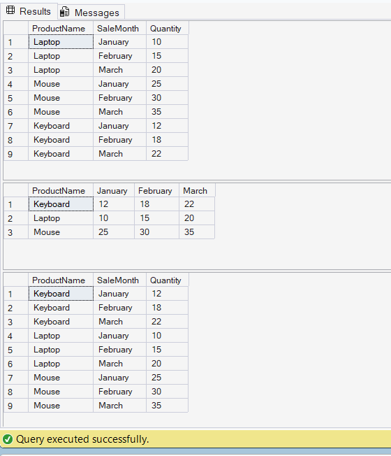

# Exercise 4: PIVOT and UNPIVOT

## Objective

Transform sales data using PIVOT and UNPIVOT operations.

## Concepts Used

* PIVOT
* UNPIVOT
* Aggregate Functions
* Data Transformation

## Table Used

* MonthlySales

## Output

## Result

Successfully transformed row-based sales data into column format using PIVOT and converted it back into row format using UNPIVOT.
