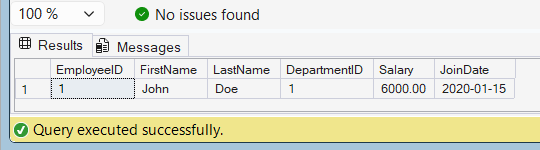

# Exercise 10 - Dynamic SQL in a Stored Procedure

## Objective

Create a stored procedure that uses Dynamic SQL to retrieve employee details using a flexible filter.

## Database

CognizantAdvancedSQL

## Stored Procedure

sp_GetEmployeesDynamic

## SQL Used

```sql
CREATE PROCEDURE sp_GetEmployeesDynamic
    @FilterColumn VARCHAR(50),
    @FilterValue VARCHAR(100)
AS
BEGIN

    DECLARE @SQL NVARCHAR(MAX);

    SET @SQL =
    'SELECT *
     FROM Employees
     WHERE ' + QUOTENAME(@FilterColumn) + ' = @Value';

    EXEC sp_executesql
        @SQL,
        N'@Value VARCHAR(100)',
        @Value = @FilterValue;

END;
```

## Execution

```sql
EXEC sp_GetEmployeesDynamic
    'FirstName',
    'John';
```

## Output Screenshot



## Concepts Used

* Stored Procedures
* Dynamic SQL
* sp_executesql
* Parameters
* Flexible Filtering

## Result

Successfully created and executed a stored procedure using Dynamic SQL to retrieve employee details based on user-defined filters.
