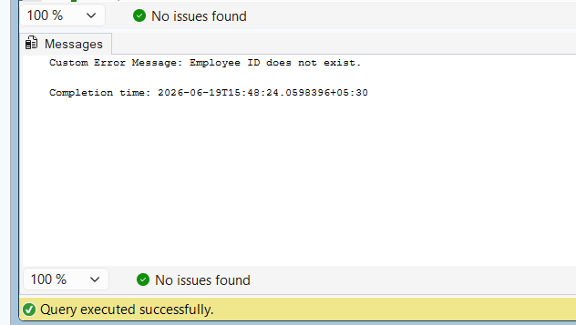

# Exercise 11 - Error Handling in a Stored Procedure

## Objective

Create a stored procedure that handles errors and returns a custom error message.

## Database

CognizantAdvancedSQL

## Stored Procedure

sp_UpdateEmployeeSalaryWithErrorHandling

## SQL Used

```sql id="gc7zji"
CREATE PROCEDURE sp_UpdateEmployeeSalaryWithErrorHandling
    @EmployeeID INT,
    @NewSalary DECIMAL(10,2)
AS
BEGIN

    BEGIN TRY

        IF NOT EXISTS
        (
            SELECT 1
            FROM Employees
            WHERE EmployeeID = @EmployeeID
        )
        BEGIN
            RAISERROR('Employee ID does not exist.',16,1);
            RETURN;
        END

        UPDATE Employees
        SET Salary = @NewSalary
        WHERE EmployeeID = @EmployeeID;

    END TRY

    BEGIN CATCH

        PRINT 'Custom Error Message: '
              + ERROR_MESSAGE();

    END CATCH

END;
```

## Execution

```sql id="nt4vjq"
EXEC sp_UpdateEmployeeSalaryWithErrorHandling
    999,
    8000.00;
```

## Output Screenshot



## Concepts Used

* Stored Procedures
* TRY...CATCH
* RAISERROR
* Custom Error Messages
* Exception Handling

## Result

Successfully created a stored procedure that handles errors using TRY...CATCH and returns a custom error message when an invalid EmployeeID is provided.
