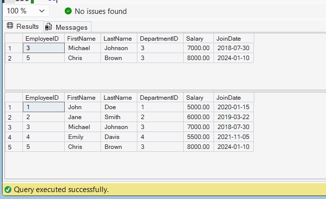

## Output Screenshot

The following screenshot shows the successful execution of:

- sp_InsertEmployee
- sp_GetEmployeesByDepartment

---

## Result

Successfully created and executed stored procedures to:

1. Insert employee records.
2. Retrieve employees by Department ID.
3. Verify results using SQL Server output.