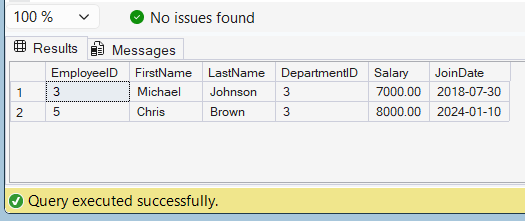

# Exercise 2 - Modify a Stored Procedure

## Objective

Modify the existing stored procedure to include the Salary column in the result.

## Database

CognizantAdvancedSQL

## Stored Procedure

sp_GetEmployeesByDepartment

## Modified Query

```sql
ALTER PROCEDURE sp_GetEmployeesByDepartment
    @DepartmentID INT
AS
BEGIN
    SELECT
        EmployeeID,
        FirstName,
        LastName,
        DepartmentID,
        Salary,
        JoinDate
    FROM Employees
    WHERE DepartmentID = @DepartmentID;
END;
```

## Execution

```sql
EXEC sp_GetEmployeesByDepartment 3;
```

## Output Screenshot



## Result

Successfully modified the stored procedure to return employee salary information along with other employee details.