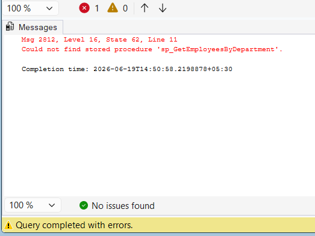

# Exercise 3 - Delete a Stored Procedure

## Objective

Delete the stored procedure created in Exercise 1.

## Database

CognizantAdvancedSQL

## SQL Used

```sql
DROP PROCEDURE IF EXISTS sp_GetEmployeesByDepartment;
```

## Verification

```sql
EXEC sp_GetEmployeesByDepartment 3;
```

## Expected Result

SQL Server displays:

Could not find stored procedure 'sp_GetEmployeesByDepartment'

This confirms that the procedure was successfully deleted.

## Output Screenshot



## Concepts Used

- DROP PROCEDURE
- Stored Procedures
- Procedure Management

## Result

Successfully deleted the stored procedure and verified its removal.