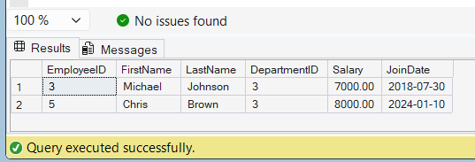

# Exercise 4 - Execute a Stored Procedure

## Objective

Execute an existing stored procedure to retrieve employee details for a specific department.

## Database

CognizantAdvancedSQL

## Stored Procedure

sp_GetEmployeesByDepartment

## SQL Command

```sql
EXEC sp_GetEmployeesByDepartment 3;
```

## Parameter Used

DepartmentID = 3

## Output

The stored procedure returns all employees belonging to Department 3.

## Output Screenshot



## Concepts Used

* Stored Procedures
* Procedure Execution
* Input Parameters
* Data Retrieval

## Result

Successfully executed the stored procedure and retrieved employee details for the specified department.
