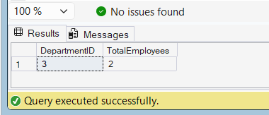

# Exercise 5 - Return Data from a Stored Procedure

## Objective

Create a stored procedure that returns the total number of employees in a specified department.

## Database

CognizantAdvancedSQL

## Stored Procedure

sp_GetEmployeeCountByDepartment

## SQL Used

```sql
CREATE PROCEDURE sp_GetEmployeeCountByDepartment
    @DepartmentID INT
AS
BEGIN
    SELECT
        @DepartmentID AS DepartmentID,
        COUNT(*) AS TotalEmployees
    FROM Employees
    WHERE DepartmentID = @DepartmentID;
END;
```

## Execution

```sql
EXEC sp_GetEmployeeCountByDepartment 3;
```

## Output Screenshot



## Concepts Used

* Stored Procedures
* COUNT Aggregate Function
* Parameters
* Data Retrieval

## Result

Successfully created a stored procedure that returns the total number of employees in a specified department.
