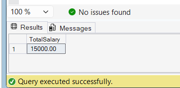

# Exercise 6 - Output Parameters in Stored Procedure

## Objective

Create a stored procedure that returns the total salary of employees in a department using an OUTPUT parameter.

## Database

CognizantAdvancedSQL

## Stored Procedure

sp_GetTotalSalaryByDepartment

## SQL Used

```sql
CREATE PROCEDURE sp_GetTotalSalaryByDepartment
    @DepartmentID INT,
    @TotalSalary DECIMAL(18,2) OUTPUT
AS
BEGIN
    SELECT
        @TotalSalary = SUM(Salary)
    FROM Employees
    WHERE DepartmentID = @DepartmentID;
END;
```

## Execution

```sql
DECLARE @SalaryTotal DECIMAL(18,2);

EXEC sp_GetTotalSalaryByDepartment
    @DepartmentID = 3,
    @TotalSalary = @SalaryTotal OUTPUT;

SELECT @SalaryTotal AS TotalSalary;
```

## Output Screenshot



## Concepts Used

* Stored Procedures
* OUTPUT Parameters
* SUM Aggregate Function
* Variables
* Parameter Passing

## Result

Successfully created and executed a stored procedure that returns the total salary of employees in a department using an OUTPUT parameter.
