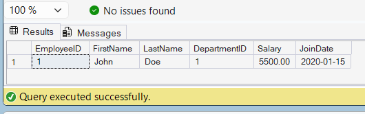

# Exercise 7 - Stored Procedure with Multiple Parameters

## Objective

Create a stored procedure to update an employee's salary using multiple parameters.

## Database

CognizantAdvancedSQL

## Stored Procedure

sp_UpdateEmployeeSalary

## SQL Used

```sql
CREATE PROCEDURE sp_UpdateEmployeeSalary
    @EmployeeID INT,
    @Salary DECIMAL(10,2)
AS
BEGIN
    UPDATE Employees
    SET Salary = @Salary
    WHERE EmployeeID = @EmployeeID;
END;
```

## Execution

```sql
EXEC sp_UpdateEmployeeSalary 1, 5500.00;
```

## Verification

```sql
SELECT *
FROM Employees
WHERE EmployeeID = 1;
```

## Output Screenshot



## Concepts Used

* Stored Procedures
* Multiple Parameters
* UPDATE Statement
* Data Modification

## Result

Successfully created and executed a stored procedure to update employee salary using multiple parameters.
