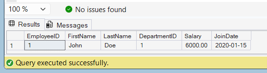

# Exercise 8 - Stored Procedure with Conditional Logic

## Objective

Create a stored procedure to give a bonus to employees based on their department.

## Database

CognizantAdvancedSQL

## Stored Procedure

sp_GiveBonus

## SQL Used

```sql
CREATE PROCEDURE sp_GiveBonus
    @DepartmentID INT,
    @BonusAmount DECIMAL(10,2)
AS
BEGIN
    IF EXISTS (
        SELECT 1
        FROM Employees
        WHERE DepartmentID = @DepartmentID
    )
    BEGIN
        UPDATE Employees
        SET Salary = Salary + @BonusAmount
        WHERE DepartmentID = @DepartmentID;
    END
END;
```

## Execution

```sql
EXEC sp_GiveBonus 1, 500.00;
```

## Verification

```sql
SELECT *
FROM Employees
WHERE DepartmentID = 1;
```

## Output Screenshot



## Concepts Used

* Stored Procedures
* Conditional Logic (IF ELSE)
* UPDATE Statement
* Parameters

## Result

Successfully created and executed a stored procedure that applies bonus amounts to employees based on department.
