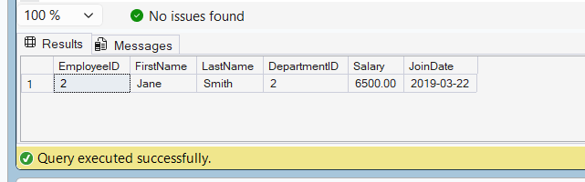

# Exercise 9 - Transactions in a Stored Procedure

## Objective

Create a stored procedure that updates employee salary and uses a transaction to ensure data integrity.

## Database

CognizantAdvancedSQL

## Stored Procedure

sp_UpdateSalaryWithTransaction

## SQL Used

```sql
CREATE PROCEDURE sp_UpdateSalaryWithTransaction
    @EmployeeID INT,
    @NewSalary DECIMAL(10,2)
AS
BEGIN
    BEGIN TRY

        BEGIN TRANSACTION;

        UPDATE Employees
        SET Salary = @NewSalary
        WHERE EmployeeID = @EmployeeID;

        COMMIT TRANSACTION;

    END TRY

    BEGIN CATCH

        ROLLBACK TRANSACTION;

    END CATCH
END;
```

## Execution

```sql
EXEC sp_UpdateSalaryWithTransaction
    2,
    6500.00;
```

## Verification

```sql
SELECT *
FROM Employees
WHERE EmployeeID = 2;
```

## Output Screenshot



## Concepts Used

* Stored Procedures
* Transactions
* BEGIN TRANSACTION
* COMMIT
* ROLLBACK
* TRY...CATCH
* Data Integrity

## Result

Successfully updated employee salary using a transaction-based stored procedure while ensuring data integrity.
