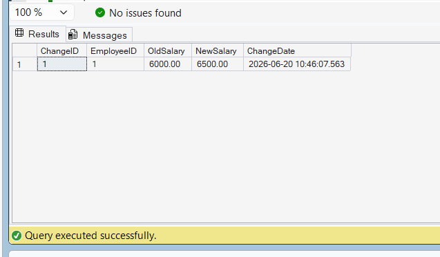

# Exercise 1: Create an AFTER Trigger

## Goal

Create an AFTER trigger to log salary changes in the Employees table.

## Create Change Log Table

```sql
CREATE TABLE EmployeeChanges
(
    ChangeID INT IDENTITY(1,1) PRIMARY KEY,
    EmployeeID INT,
    OldSalary DECIMAL(10,2),
    NewSalary DECIMAL(10,2),
    ChangeDate DATETIME DEFAULT GETDATE()
);
```

## Create AFTER Trigger

```sql
CREATE TRIGGER trg_AfterSalaryUpdate
ON Employees
AFTER UPDATE
AS
BEGIN
    INSERT INTO EmployeeChanges
    (
        EmployeeID,
        OldSalary,
        NewSalary
    )
    SELECT
        d.EmployeeID,
        d.Salary,
        i.Salary
    FROM deleted d
    INNER JOIN inserted i
        ON d.EmployeeID = i.EmployeeID
    WHERE d.Salary <> i.Salary;
END;
```

## Test Query

```sql
UPDATE Employees
SET Salary = 6500
WHERE EmployeeID = 1;

SELECT * FROM EmployeeChanges;
```

## Explanation

- Created a table named `EmployeeChanges` to store salary modification history.
- Created an AFTER UPDATE trigger on the Employees table.
- The trigger automatically records old and new salary values whenever salary is modified.

## Output Screenshot



## Result

Successfully created and tested an AFTER trigger that logs employee salary changes.