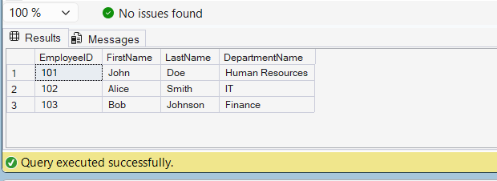

# Exercise 1: Create a Simple View

## Objective

Create a view named `vw_EmployeeBasicInfo` to display employee details along with department information.

## Database Used

CognizantAdvancedSQL

## SQL Concepts

- Views
- Inner Join
- Data Abstraction

## Query

```sql
CREATE VIEW vw_EmployeeBasicInfo
AS
SELECT
    E.EmployeeID,
    E.FirstName,
    E.LastName,
    D.DepartmentName
FROM Employees E
INNER JOIN Departments D
ON E.DepartmentID = D.DepartmentID;
```

## Output

| EmployeeID | FirstName | LastName | DepartmentName |
|------------|-----------|-----------|----------------|
| 101 | John | Doe | Human Resources |
| 102 | Alice | Smith | IT |
| 103 | Bob | Johnson | Finance |

## Screenshot



## Result

Successfully created a view named `vw_EmployeeBasicInfo` that displays employee details along with their department names.