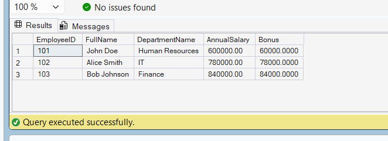

# Exercise 4: Employee Report View

## Objective

Create a view that combines multiple computed columns and department information.

## View Created

vw_EmployeeReport

## Features

- EmployeeID
- FullName
- DepartmentName
- AnnualSalary
- Bonus (10% of Annual Salary)

## SQL Query

```sql
CREATE VIEW vw_EmployeeReport
AS
SELECT
    E.EmployeeID,
    E.FirstName + ' ' + E.LastName AS FullName,
    D.DepartmentName,
    E.Salary * 12 AS AnnualSalary,
    (E.Salary * 12) * 0.10 AS Bonus
FROM Employees E
INNER JOIN Departments D
ON E.DepartmentID = D.DepartmentID;
```

## Output

| EmployeeID | FullName | DepartmentName | AnnualSalary | Bonus |
|------------|----------|----------------|-------------|--------|
| 101 | John Doe | Human Resources | 600000.00 | 60000.00 |
| 102 | Alice Smith | IT | 780000.00 | 78000.00 |
| 103 | Bob Johnson | Finance | 840000.00 | 84000.00 |

## Screenshot



## Result

Successfully created a view containing multiple computed columns including FullName, AnnualSalary and Bonus.